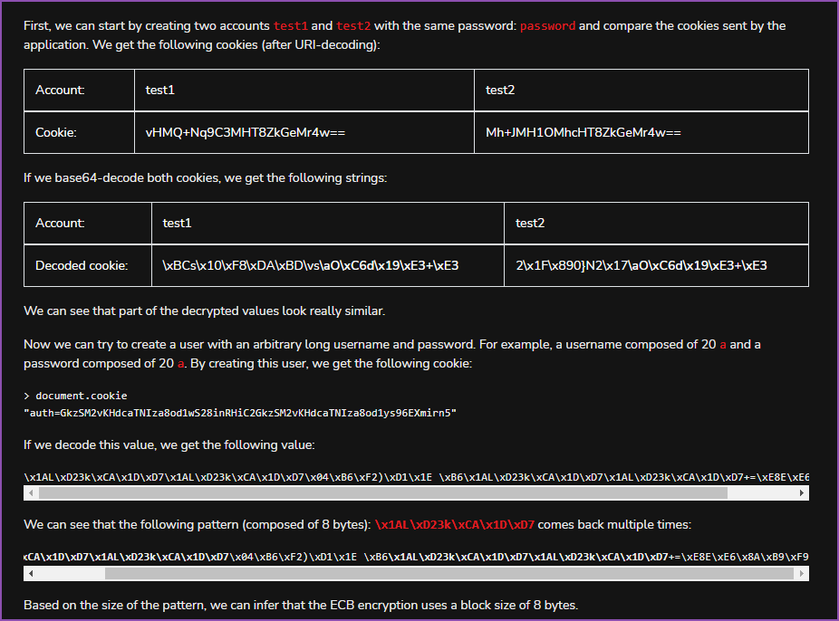

# Electronic Code Book

The website uses ECB to encrypt information provided by users and use this information to ensure authentication.

## ECB

ECB is an encryption mode in which the message is split into blocks of X bytes length and each block is encrypted separately using a key.

Now how to get this.

Create two accounts, test1 and test2. with the same password, and compare the cookies.

.png>)

.png>)

.png>)

.png>)

.png>)
